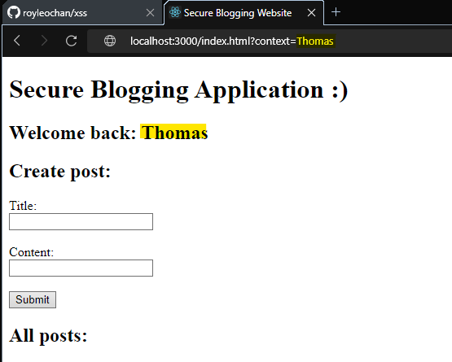
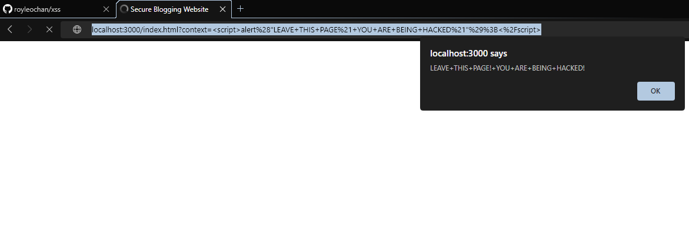

# Run server

```
npm i
node index.js
```
Dom-based XSS
Normal URL: localhost:3000/index.html?context=Thomas

Malicious URL: localhost:3000/index.html?context=%3Cscript%3Ealert%28%22LEAVE+THIS+PAGE%21+YOU+ARE+BEING+HACKED%21%22%29%3B%3C%2Fscript%3E
